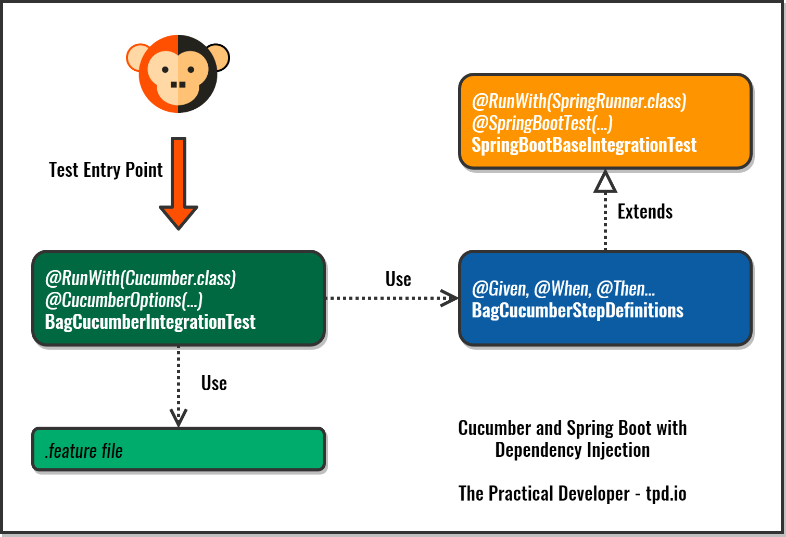

# Cucumber in Spring Boot using Dependency Injection

This code sample shows how to use Dependency Injection in Cucumber within a Spring Boot application.

You can find the complete instructions on this post at The Practical Developer site: [Cucumber Tests with Dependency Injection using Spring Boot](https://thepracticaldeveloper.com/cucumber-tests-spring-boot-dependency-injection//)

